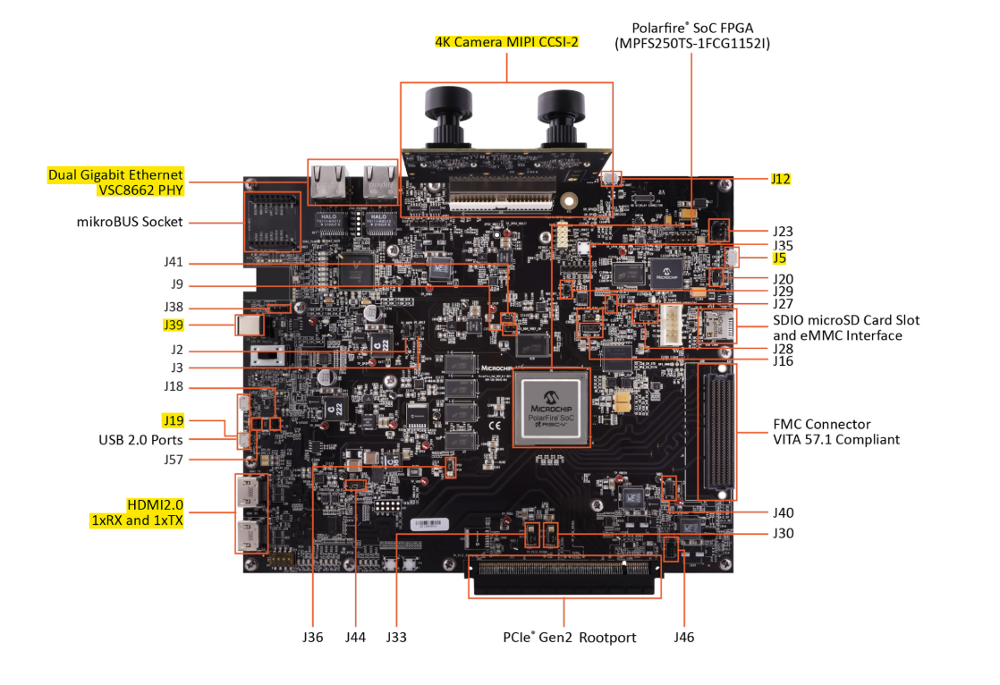

# PolarFire&reg; SoC Video Kit VectorBlox Demo QuickStart Guide

This document provides a guide for quickly setting up and generating a VectorBlox demo using the PolarFire SoC Video Kit. Complete the prerequisites, then follow the board setup steps. Finally, refer to the “Running the VectorBlox Demo” section for instructions on operating the board.


## Table of Contents
- [QuickStart Prerequisites](#quickstart-prerequisites)
- [Board Setup](#board-setup)
  - [Step 1: Jumper Configuration](#step-1-jumper-configuration)
  - [Step 2: Hardware Connections](#step-2-hardware-connections)
  - [Step 3: Programming the Job File](#step-3-programming-the-job-file)
  - [Step 4: Programming the Linux Image](#step-4-programming-the-linux-image)
  - [Step 5: Setting up the VectorBlox Demo](#step-5-setting-up-the-vectorblox-demo)
- [Running the VectorBlox Demo](#running-the-vectorblox-demo)


## QuickStart Prerequisites
- [FlashPro Express](https://www.microchip.com/en-us/products/fpgas-and-plds/fpga-and-soc-design-tools/programming-and-debug#Download%20Software) is required to program an FPGA bitstream to a target development kit. FlashPro Express can be installed as a standalone tool with the Program and Debug tools and is also installed with Libero SoC.
- [USBImager](https://bztsrc.gitlab.io/usbimager/) is required to program a Linux image to a target memory using the Hart Software Services.
- [Setup Serial Terminal](https://onlinedocs.microchip.com/oxy/GUID-E89F0380-CE10-4E39-B622-CA56F677F477-en-US-3/GUID-252CFF5A-1DB8-421F-B210-A5C575B68FE7.html)


## Board Setup


### Step 1: Jumper Configuration
The PolarFire SoC Video Kit comes with the jumpers set up correctly. If you change the jumpers or encounter issues, refer to the jumper section of the [VectorBlox v3.0 PolarFire SoC Video Kit Demo Guide PDF](VectorBlox_v3.0_PolarFire_SoC_Video_Kit_Demo_Guide.pdf).


**Note:** Jumpers J16 and J35 should **<u>not</u>** be open. Make sure they are connected to pins 2 and 3.


### Step 2: Hardware Connections



The highlighted areas in the image show the locations of the required connections listed in the table below.


| Port | Type | Description                                                                    |
|:-------|:--------|:--------------------------------------------------------------------------|
| 4K Camera MIPI     | Camera    |    Dual camera sensor module   |
| J13 HDMI 1xRX    | HDMI    |      Connect this HDMI to the host PC for input video|
| J14 HDMI 1xTx  | HDMI  | Connect this HDMI to the output monitor for output video display |
| Dual Gigabit Ethernet | Ethernet    |  Used for ssh commands and downloading sample models and SDK, ethier ethernet port will suffice |
| J39 | Power Adapter    | 12V, 5A power cord     |
| J12    | Micro USB  |  UART port, interacts with the FPGA via the Hart Software Service/HSS(UART0) and the Linux terminal (UART1)|   
| J5    | Micro USB   | FlashPro6 port, used to program the job file|   
| J19    | Micro USB   |  USB OBJ port, used to transfer YOCTO image with USBImage after flashing .job file|    


### Step 3: Programming the Job File
Programming the [job](https://github.com/Microchip-Vectorblox/VectorBlox-SoC-Video-Kit-Demo/releases) file will program the FPGA fabric with the latest reference configuration and also program the eNVM with the latest HSS payload. The .zip file in the release assets should be downloaded and extracted to access the programming job file. 
- Ensure J5 and J12 USB cables are connected to the board.
- Follow the steps to set up the serial terminal so the computer can communicate with the FPGA's UART. 
- Load the `.job` file in FlashPro Express as a New Project under the Project tab in the menu and then select `Run`.
- Power-cycle the board once the process is complete.


### Step 4: Programming the Linux Image
Currently, the VectorBlox SoC Video Kit Demo is designed to operate on the 2023.02.1 Yocto release, which should be pre-installed. 

- First, [download this file](https://github.com/polarfire-soc/meta-polarfire-soc-yocto-bsp/releases/download/v2023.02.1/core-image-minimal-dev-mpfs-video-kit-20230328105837.rootfs.wic.gz) to flash this image.
- Once downloaded and unzipped, follow the steps in [flashing_yocto_linux.md](./flashing_yocto_linux.md) under the eMMC Content Update Procedure section.
- To check the Linux version information, log in as `root` (no password needed) on UART1 and enter `uname -r`in the command line. This will display the Yocto version.


### Step 5: Setting Up the VectorBlox Demo
- Log in as `root` (on MMUART1 or via SSH over Ethernet, IP address for the board can be obtained via either typing `ifconfig` or `ip a | grep dynamic` in the Command Line Interface)
- HDMI cables connected to the PolarFire SoC Video Kit (Rx/Tx)
    > If any issues appear such as noise/white screen appear on the output, please check cables and power-cycle the board
- Plug the camera daughter card into the PolarFire SOC video kit board if it's not already connected.
- Download and run the [quick_start_3_0.sh] script(https://raw.githubusercontent.com/Microchip-Vectorblox/assets/refs/heads/main/quick_start_3_0.sh) to the root directory:
    ```
    wget --no-check-certificate https://raw.githubusercontent.com/Microchip-Vectorblox/assets/refs/heads/main/quick_start_3_0.sh 
    ```
- The `quick_start_3_0.sh` script accepts a version parameter; if none is provided, it defaults to `3.0`. This feature will only work on Vectorblox 3.0 or higher. If using an older version of Vectorblox please see corresponding tag. 

- If using the default `.job` file, run the following command:
	```
    bash quick_start_3_0.sh
    ```

- If using `COMP` or `UCOMP` `.job` files, specify the configuration with the following commands:
	```
    bash quick_start_3_0.sh 3.0 COMP
    ```
    or
    ```
    bash quick_start_3_0.sh 3.0 UCOMP
    ```

 > NOTE: If swapping between `.job` files, please delete any pre-existing `VectorBlox-SDK-release` folders before re-running the quickstart command

- Once the `quick_start_3_0.sh` script is finished, wait around 30s, and power cycle the board, as there can be a delay in file transfer


----------------------------------------------------
Info: `v4l2-start_service.sh` is a startup service that runs automatically at Linux boot. Between the HDMI input and the Camera input path, HDMI has priority and is always selected if plugged in.  For the camera path to be active, the HDMI input needs to be unplugged.

## Controlling the VectorBlox Demo
To interact with the VectorBlox Video demo the following can be done:
    
- Use the `ENTER` key to switch models. Entering `q` (pressing `q` and `ENTER`) quits the demo.
- In the `Recognition` mode, you can enter `a` to add or `d` to delete face embeddings.
    - Entering `a` initially highlights the largest face on-screen, and entering `a` again adds that face to the embeddings. You will then be prompted to enter a name( or just press `ENTER` to use the default ID)

    - Entering `d` will list the indices and names of the embeddings. Enter the desired index to delete the specified embedding from the database (or press `ENTER` to skip the deletion)

- Entering `b` on any models that use Pose Estimation for postprocessing will allow the user to toggle between blackout options for the img output.


Sample videos for input to the Face Recognition mode are available [here](https://github.com/Microchip-Vectorblox/assets/releases/download/assets/SampleFaces.mp4).
